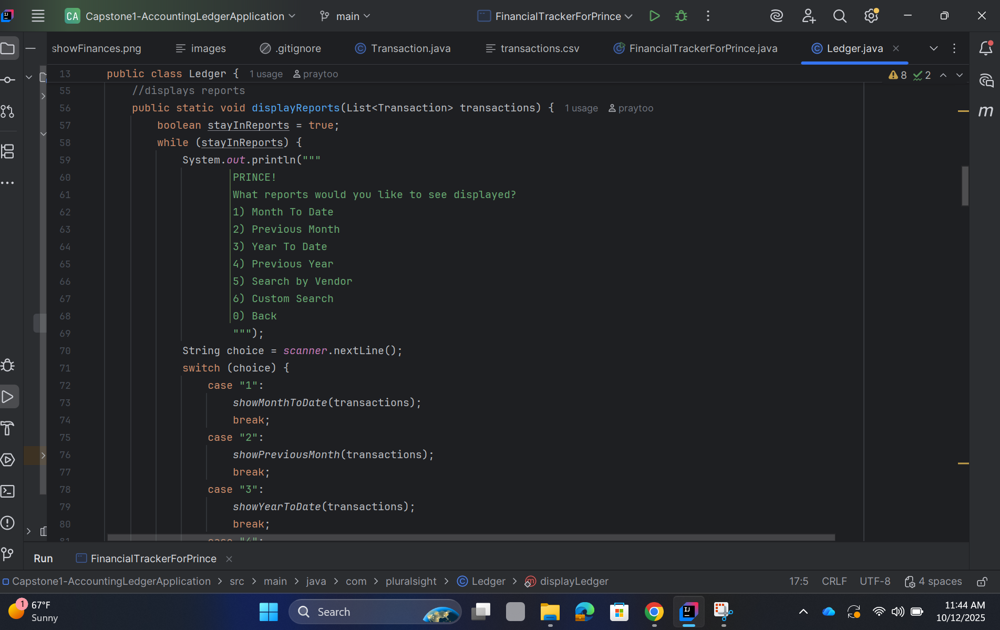
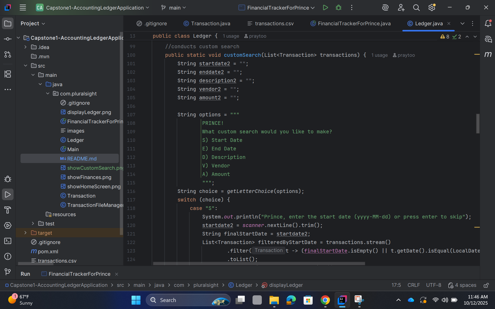

# 💰 Accounting Ledger — Financial Tracker For Prince

**A command-line accounting ledger application built in Java**  
Created as **Capstone Project 1** for *Learn To Code Academy*.

This application tracks deposits, payments, and generates reports for personal or business use — all stored in a local `transactions.csv` file.

---

 📚 Table of Contents
---

- [🎬 Demo Overview](#-demo-overview)
- [⚙️ Features](#️-features)
- [📋 Requirements](#-requirements)
- [📦 Installation](#-installation)
- [💡 Interesting Code](#-interesting-code)
- [👤 Author](#-author)
- [📜 License](#-license)
- [📚 References](#-references)

---

🎬 Demo Overview
---

The application launches with a custom welcome screen (**“Welcome Prince”**) and allows you to:

- 💵 **Add deposits or payments**
- 📊 **View the ledger by category** — All, Deposits, or Payments
- 🧾 **Generate reports** — Month-to-Date, Previous Month, Year-to-Date, or Previous Year
- 🔍 **Run custom searches** across multiple filters

```java
// In FinancialTrackerForPrince.java

public static boolean showHomeScreen() {
    String options = """
            WELCOME PRINCE
            Would you like to...
            D) Add deposit
            P) Make Payment
            L) Ledger
            X) Exit
            """;

    switch (getLetterChoice(options)) {
        case "D":
            TransactionFileManager.addDeposit();
            break;
        case "P":
            TransactionFileManager.addPayment();
            break;
        case "L":
            Ledger.displayLedger();
            break;
        case "X":
            return true;
        default:
            System.out.println("Prince, that's not an option.");
            break;
    }
    return false;
}
```

```java

// In Ledger.java

// Displays the ledger options and runs the main ledger menu
public static boolean displayLedger() {
List<Transaction> transactions = TransactionFileManager.loadTransactions();
String options = """
PRINCE!
Would you like to view...
A) All
D) Deposits
P) Payments
R) Reports
H) Home
""";

    switch (getLetterChoice(options)) {
        case "A":
            showLedger();
            break;
        case "D":
            displayDeposits(transactions);
            break;
        case "P":
            displayPayments(transactions);
            break;
        case "R":
            displayReports(transactions);
            break;
        case "H":
            showHomeScreen();
        case "X":
            System.out.println("Goodbye Prince!");
            System.exit(0);
            break;
        default:
            System.out.println("Prince, that's not an option.");
            break;
    }
    return false;
}
```




👉 **GitHub Repository:**  
[Capstone1-AccountingLedgerApplication](https://github.com/praytoo/Capstone1-AccountingLedgerApplication)

---

## ⚙️ Features

- **Add Deposit (`D`)** — Prompts user for deposit info and saves to file
- **Make Payment (`P`)** — Prompts user for debit info and saves to file
- **Ledger Menu (`L`)** — Displays transaction categories:
    - All (`A`)
    - Deposits (`D`)
    - Payments (`P`)
    - Reports (`R`) — month-to-date, previous month, year-to-date, previous year, search by vendor, custom search
- **Reports (`R`)**
    - Filter transactions by time range or vendor
    - Includes **Custom Search (6)** — filter by start date, end date, description, vendor, or amount
- **Saves data** in a simple `transactions.csv` format:
  date|time|description|vendor|amount
- **Customized Experience** — personalized branding and dialogue (“Prince!”).

---

## 📋 Requirements

### Home Screen
The home screen should give the user the following options.  
The application should continue to run until the user chooses to exit.

- `D)` **Add Deposit** — Prompt user for deposit info and save to CSV
- `P)` **Make Payment (Debit)** — Prompt user for debit info and save to CSV
- `L)` **Ledger** — Display the ledger screen
- `X)` **Exit** — Exit the application

### Ledger Screen
All entries should show the newest entries first.

- `A)` **All** — Display all entries
- `D)` **Deposits** — Display only deposits
- `P)` **Payments** — Display only debits
- `R)` **Reports** — Show reporting options
- `1)` Month To Date
- `2)` Previous Month
- `3)` Year To Date
- `4)` Previous Year
- `5)` Search by Vendor
- `6)` Custom Search *(challenge)*
- `0)` Back
- `H)` **Home** — Return to the home screen

### Custom Search
Prompts for the following search values:
- Start Date
- End Date
- Description
- Vendor
- Amount

### Customization
- Personalized app name and greeting (“FinancialTrackerForPrince”).
- The ledger resembles a real personalized finance tracker.

---
## 📦 Installation

Clone the repository from GitHub:

```bash
git clone https://github.com/praytoo/Capstone1-AccountingLedgerApplication.git
cd Capstone1-AccountingLedgerApplication
```
💡 Interesting Code
---

Below is the section of the **Ledger.java** class that prints my financial records in a clean, formatted table view.  
This feature brings the entire accounting ledger to life — turning raw transaction data into an organized console report.

```java
// In Ledger.java

// Responsible for printing transactions in a formatted table
private static void printTransactions(List<Transaction> transactions) {
    if (transactions.isEmpty()) {
        System.out.println("Prince, there are no matching transactions found.");
        return;
    }

    System.out.println("WELCOME PRINCE: HERE ARE YOUR FINANCES");
    System.out.println("DATE         TIME       DESCRIPTION          VENDOR          AMOUNT");
    System.out.println("--------------------------------------------------------------------------");

    for (Transaction t : transactions) {
        System.out.printf(
            "%-12s %-10s %-20s %-15s %.2f%n",
            t.getDate(),
            t.getTime(),
            t.getDescription(),
            t.getVendor(),
            t.getAmount()
        );
    }
}
```
🧠 Why It’s Interesting:
---

Prints my name in a personalized way

Makes my financial data human-readable — essentially a miniature report generator built into the console.

Sample Output:
```
WELCOME PRINCE: HERE ARE YOUR FINANCES
DATE         TIME       DESCRIPTION          VENDOR          AMOUNT
--------------------------------------------------------------------------
2025-10-11   14:10:58   Car payment          Tesla           -762.00
2025-10-10   13:18:24   Refund               Uber Eats        200.00
2025-10-10   15:06:22   Car insurance        Tesla           -390.00
2025-10-10   15:05:35   Gym membership       Equinox         -250.00
2025-10-10   15:02:43   Invoice 1001 paid    Year Up United  4500.00
```
---

## 👤 Author

**Prince Haywood**  
📧 Email: [phaywood@my.yearupunited.org](mailto:phaywood@my.yearupunited.org)  
🌍 Location: Playa Vista, California  
🔗 GitHub: [@praytoo](https://github.com/praytoo)

---

## 📜 License

**MIT License**  
This project is open-source and free to use under the terms of the MIT License.  
See the [LICENSE](LICENSE) file for details.

📚 References
---

Adewunmi, T. (2025). *Capstone project guidance and review* [Instructional feedback].

Van Putten, M. (2025, October 10). *Java In Class Workshop* [Workshop review]. Year Up United.

OpenAI. (2025). *ChatGPT (GPT-5)* [Large language model]. https://chat.openai.com/

> *Note:* Parts of this project were influenced by Tracy Adewunmi’s feedback during review sessions, concepts from Maaike Van Putten’s in class Workshop, and example logic generated with assistance from ChatGPT (GPT-5).

